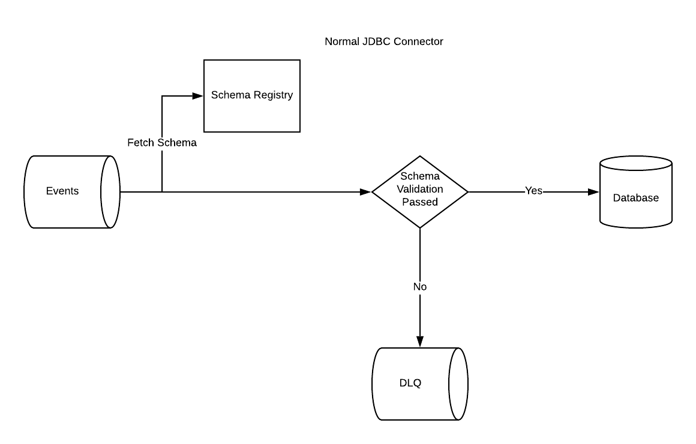
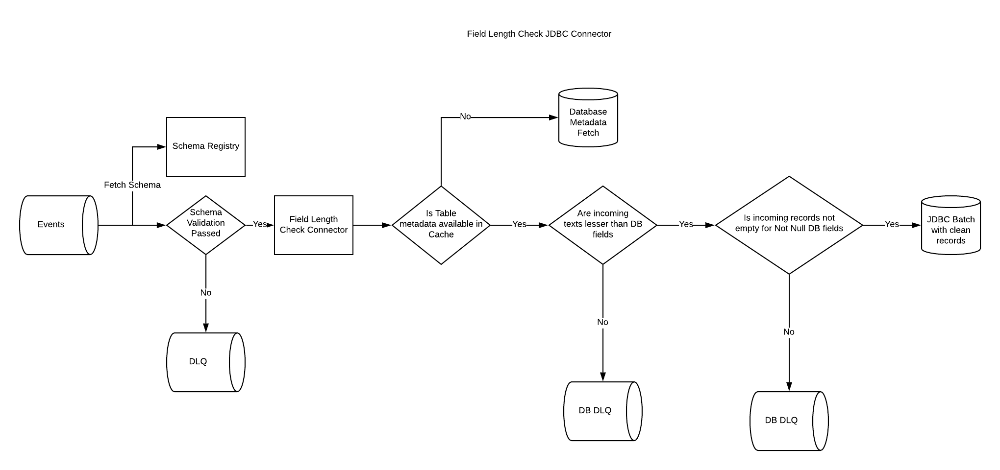

#  JDBC Field Check Connector

Out of the box Kafka JDBC connector is a generic connector which is designed to work with all kinds of Databases.
For databases like Oracle, PostgreSQL etc users can setup field length constraints. 
If the source system is not sending data which complies with these lengths, it will bring down your connector.
To avoid this you will have to setup complicated filtering logic on all of these topics to filter out data which does not comply with the table constraints. 
A better way is to bake this into the connector logic and these connector is built with the intention to do so.
The following diagrams explain this in more detail.

### JDBC Connector workflow
 

### JDBC Connector with length check workflow

### Setting up the database DLQ 
The usual connector DLQs will only contain Serialization/Deserialization errors.
Access to these topics are not available inside the connector implementation classes.
For this reason we have to provide your broker parameters and DLQ name.
If the user does not pass these parameters bad messages are ignored and not sent to DLQ.

#### DLQ parameters
You will have to provide the DLQ topic name using the parameter `LENGTH_CHECK_DEAD_LETTER_TOPIC`

All other parameters are prefixed with `LENGTH_CHECK_DEAD_LETTER_TOPIC` and then uppercased and `.` replaced with `_`.
For instance `bootstrap.servers` will be `LENGTH_CHECK_DEAD_LETTER_TOPIC_BOOTSTRAP_SERVERS`.

